#  Tenille Scott - Portfolio Task
​
https://tscott-1.github.io/
​
## Project Requirements

### Content
 Add a short paragraph describing the features below. What aesthetic and technical choices did you make? 
- [x] At least one profile picture
- [x] Biography (at least 100 words)
- [x] Functional Contact Form
- [x] "Projects" section
- [x] Links to external sites, e.g. GitHub and LinkedIn.
​
### Technical
 Add a short paragraph describing the features below. What strategies or design decisions did you work from? 
- [x] At least 2 web pages.
- [x] Version controlled with Git
- [x] Deployed on GitHub pages.
- [x] Implements responsive design principles.
- [ ] Uses semantic HTML.

My project has a landing page with a profile picture, a short biography and a list of my skills. An additional page has been added to showcase current and future projects, and I have also added in placeholder links from the landing page for a 'books' and a 'hikes' page where I would like to showcase books I have read and hikes I have done in future.  In both the landing page and the projects page, I have put in a header menu allowing users to navigate to my information or the contact form on the header page, the projects page, and in future the additional hikes and books pages. The initial design of the project was based on wireframes, with a main page, a project page and a set of mobile-style designs created at the start of the project. 
#### Main Page Wireframe Design

#### Project Page Wireframe Design
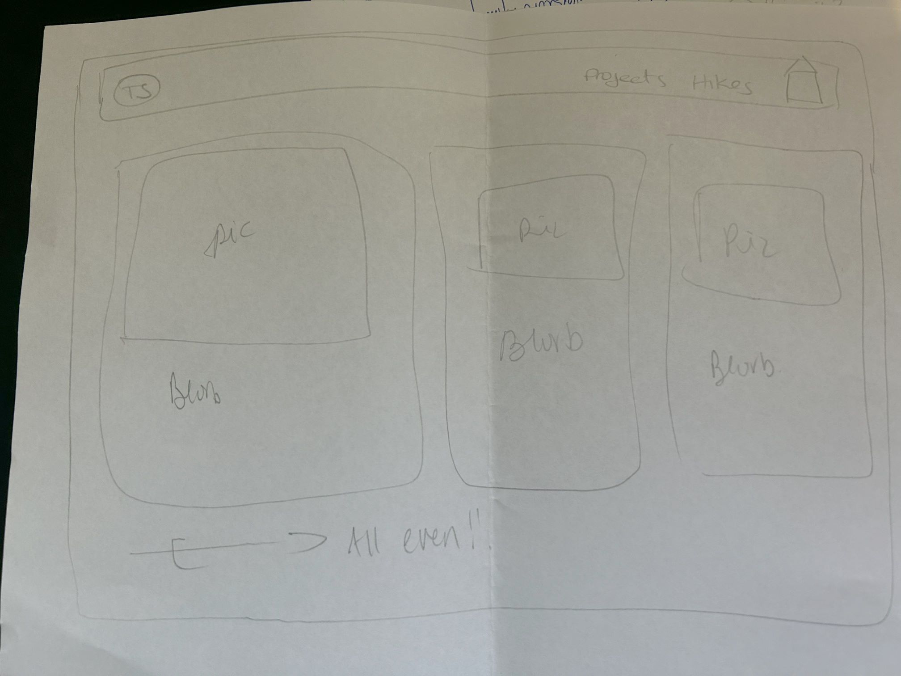
#### Mobile Format Wireframe Design
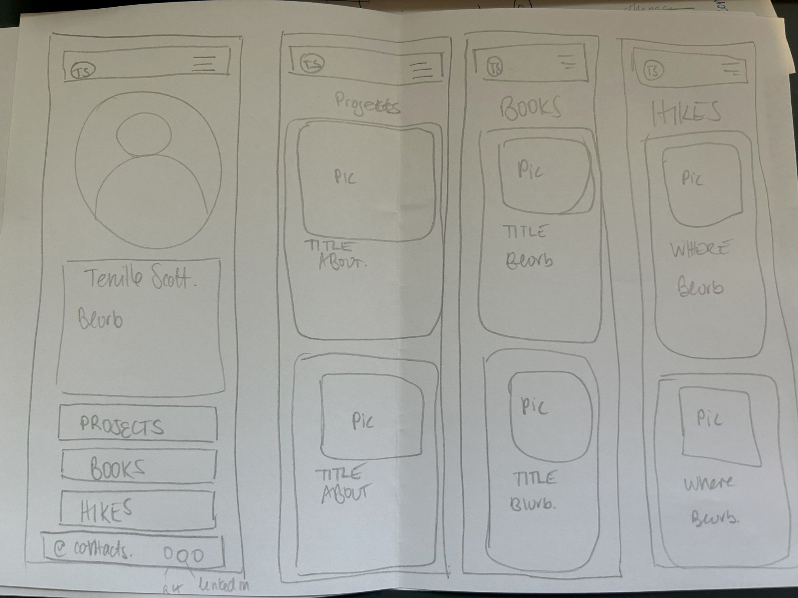

A github repository was set up at the start of a project using the template: https://github.com/SheCodesAus/plus-portfolio-project-template, and a develop branch was set up for ongoing changes to be made. Repository is available here: https://github.com/tscott-1/tscott-1.github.io . When I was getting close to completion, I have merged the develop branch into the main branch by checking out the main branch (doing a pull to ensure it is current), merging the develop branch into the main branch locally, and then pushing the updates to github.

The project has been deployed using github pages, and is available here: https://tscott-1.github.io/index.html

The pages were designed first for mobile, stacking both the hero and features on top of one another on the landing page, and the project information boxes on the projects page.  Both pages feature headers with a hamburger menu instead of a full menu at the top. For wider screens, the landing page will feature the hero section side by side - the Information and Skills sections were combined into a 'hero2' section to allow them to align next to the image. To prevent the image from growing too big forcing the information and skills to be long and narrow, the hero image was limited to taking up 1/3 of the space available on larger screens and is also limited to 400px high.  The landing page also allows the three features links/images to spread across the screen in a larger screen format, while similarly the project page will display two project information blocks side by side down the page.

#### Mobile Header showing hamburger menu and stacked hero section (image and about info)

#### Mobile features showing stacking of features links
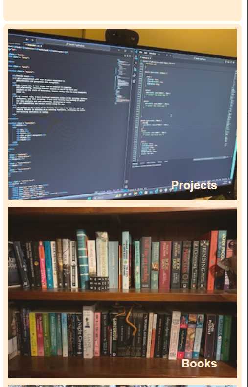
#### Mobile Projects page showing hamburger menu and stacked project info blocks
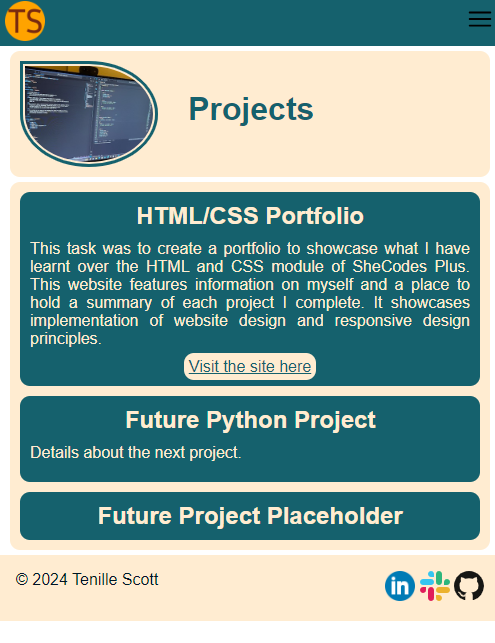
#### Desktop landing page showing menu across top, side-by-side hero and features links
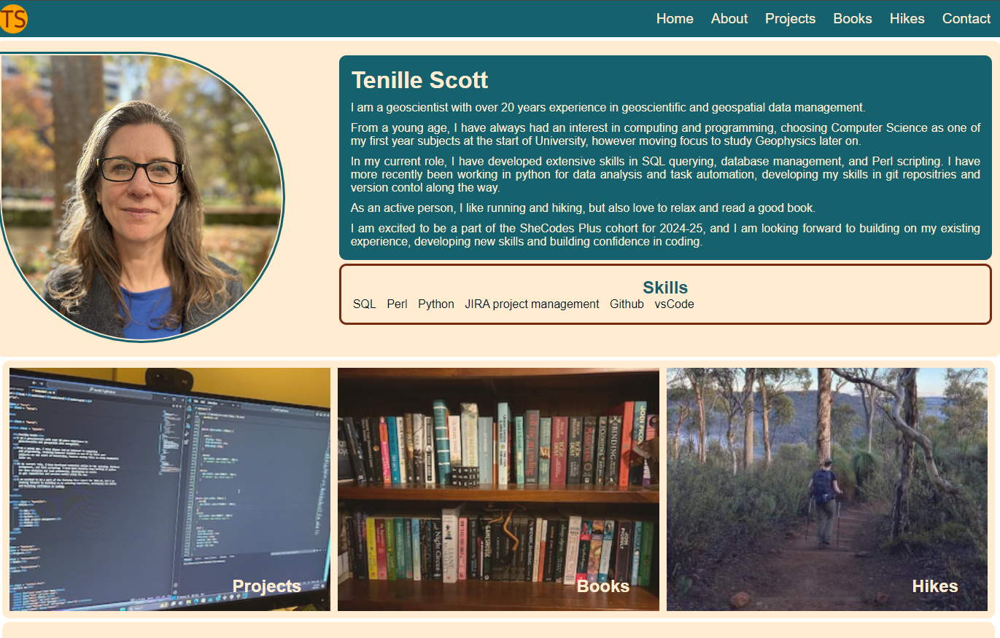
#### Desktop projects page showing menu across top and project info blocks in a 2-column format
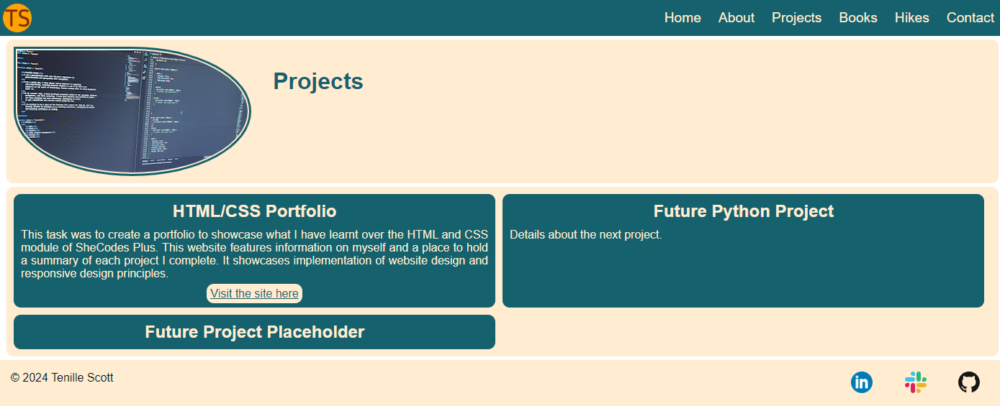

Sections on both pages have generally been set up to use header sections for the menus across the top, a hero section, a feature section and a footer section.  The landing page also has a contact section.  There are some divisions set within these sections to allow for formatting (such as grouping the landing page information and skills groups into one).

#### Example of sections use in HTML (semantic HTML)
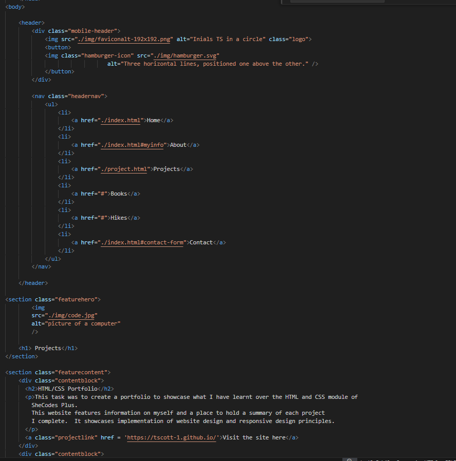

### Bonus (optional)
 Add a short paragraph describing the features below, if you included any. 
- [ ] Different styles for active, hover and focus states.
- [ ] Include JavaScript to add some dynamic elements to your site. (Extra tricky!)

In order to indicate that the Projects, Books and Hikes images are also links, the initial opacity of the images is set to 0.9 (so it does not dominate the page as much compared to the profile picture), and on hover, the images drop to 0.6 opacity to indicate they can be clicked for a link.

Similarly menu items in the header and buttons in both pages will change colour to the --action colour (variable) on hover to indicate they are selecable

#### Change in Opacity hovering over an image link
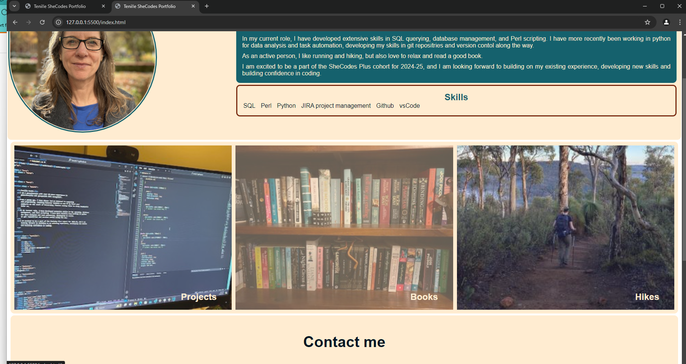
#### Change in background colour hovering over menu link
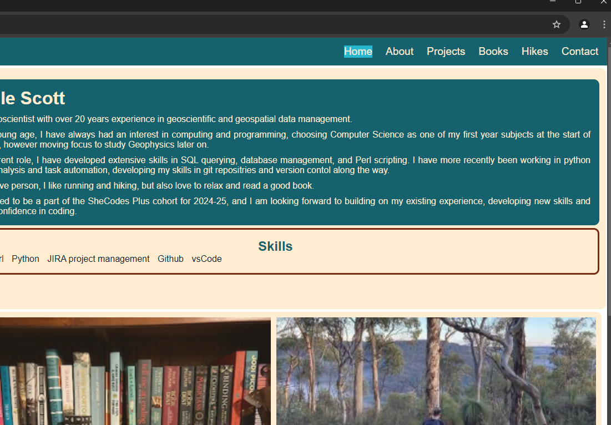
#### Change in background colour hovering over send contact button
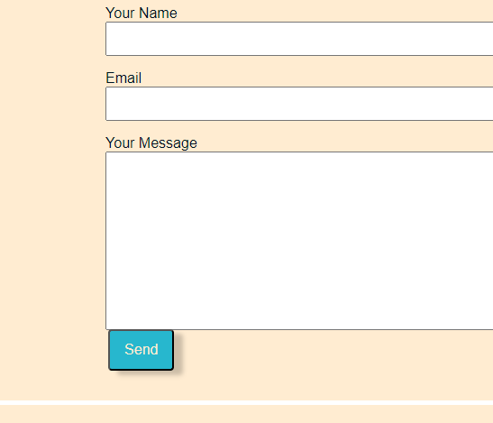
#### Change in background colour hovering over project link on projects page
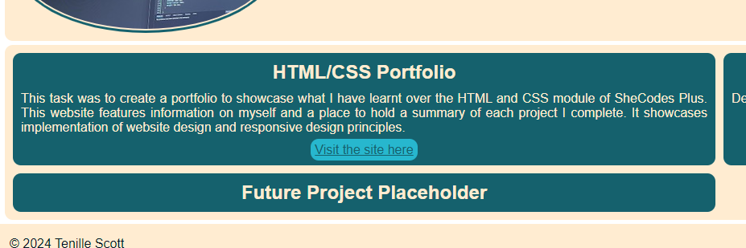
​
### Screenshots
> Please include the following:
> - The different pages and features of your website on mobile, tablet and desktop screen sizes (multiple screenshots per page and screen size).
> - The different features of your site, e.g. if you have hover states, take a screenshot that shows that.  
> 
> You can do this by saving the images in a folder in your repo, and including them in your readme document with the following Markdown code: 
